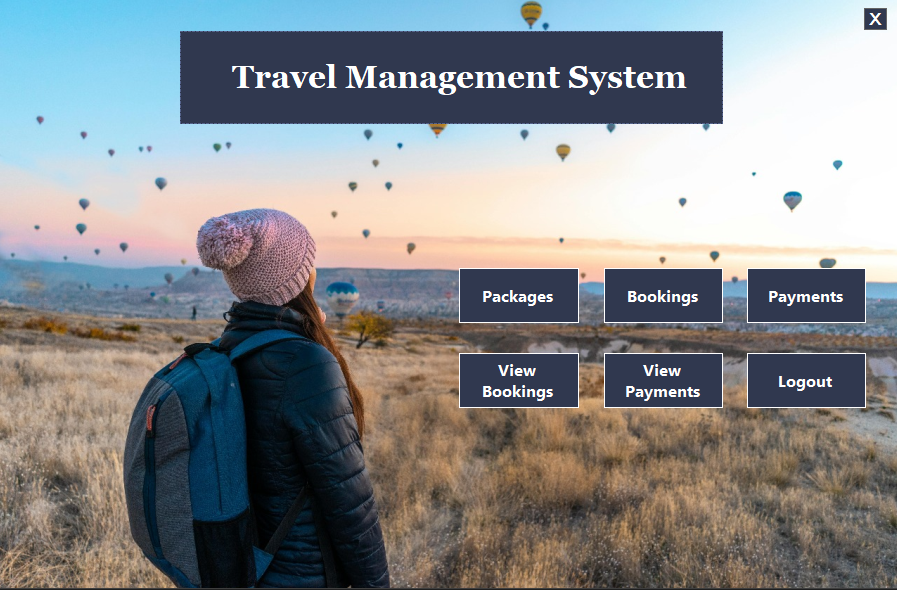
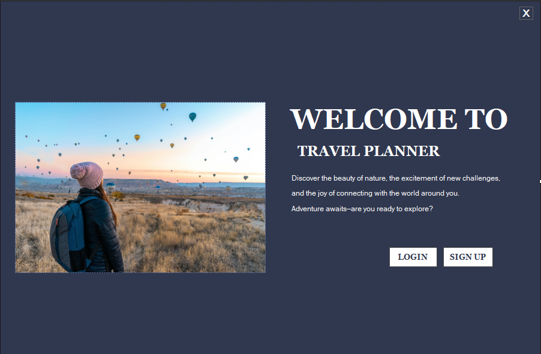
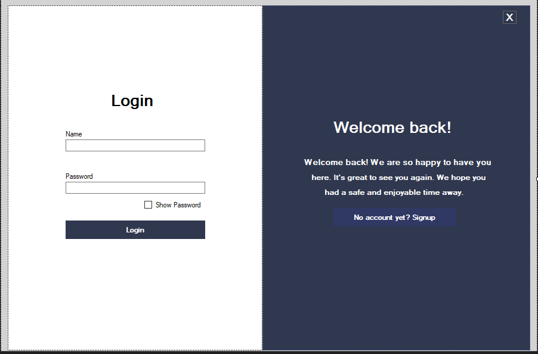
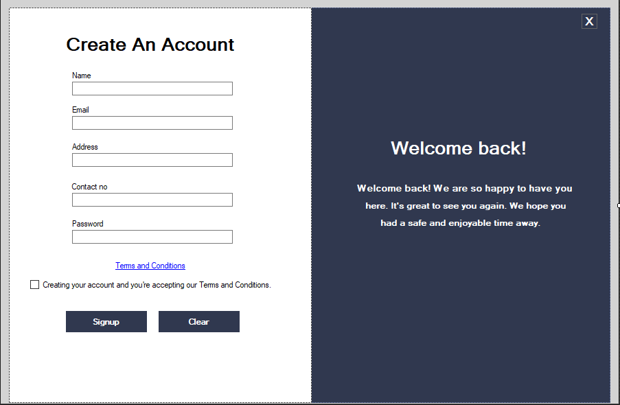
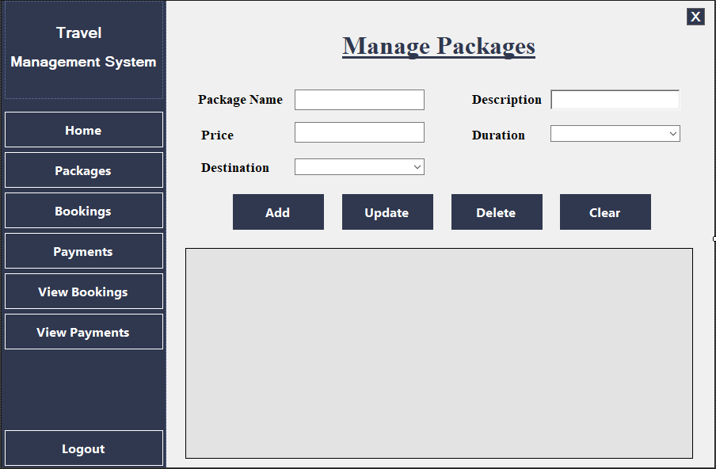
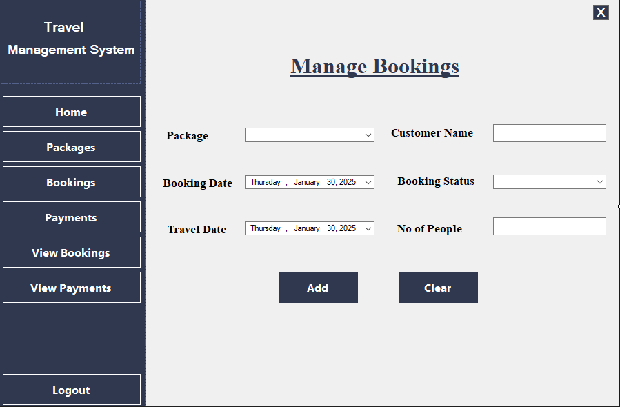
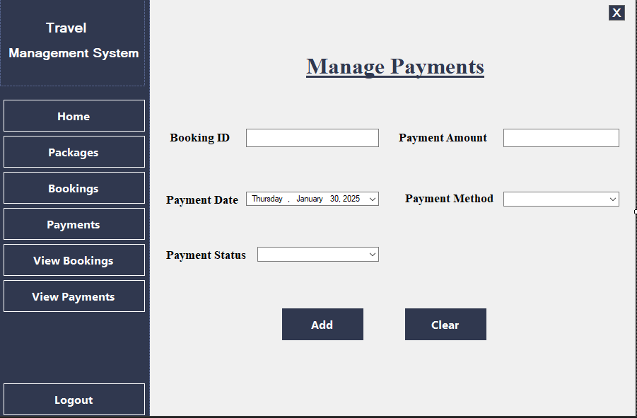
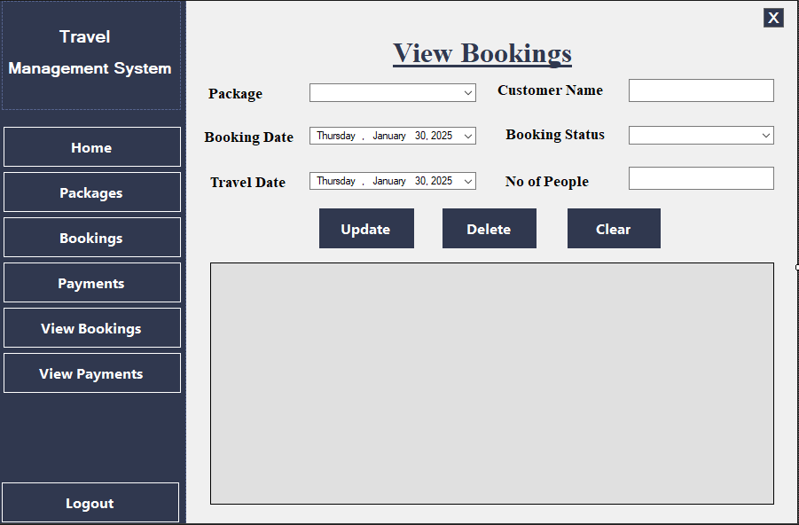
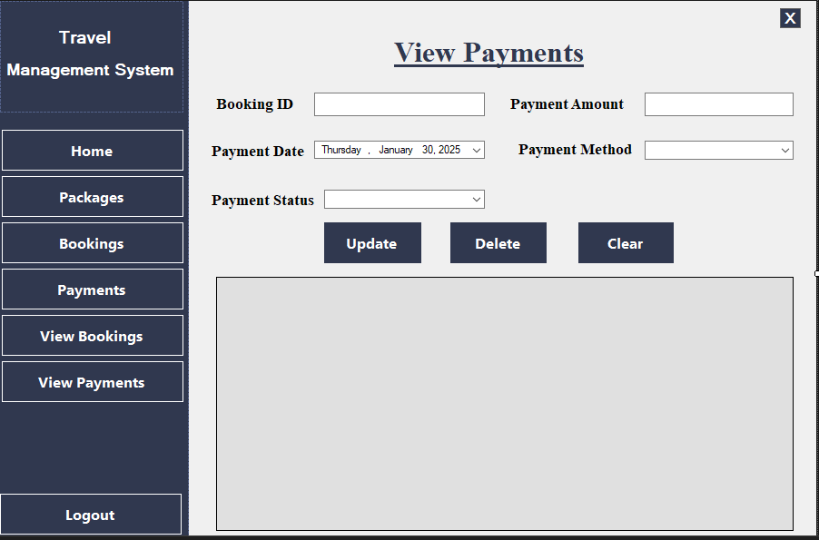

# ✈️ Travel Manager — Travel Management System

A Windows desktop application for a travel agency, built with **C# Windows Forms** and **SQL Server** (LINQ to SQL), made as our Visual Programming semester project.

Users sign up and log in, then manage **travel packages**, **bookings** and **payments** from one place.



---

## ✨ Features

- **Splash screen** with a loading bar. While it loads, the app connects to SQL Server and creates the database if it is missing.
- **Sign up / Log in**: input validation, unique user name and email, Terms & Conditions, passwords stored as SHA-256 hashes, and a "Show Password" option
- **Packages**: add, update and delete packages (name, description, price, duration, destination); click a row to edit it
- **Bookings**: the package list comes from the database, so new packages appear automatically; validated customer name, dates and number of people; the new **Booking ID** is shown after saving
- **Payments**: the Booking ID must exist; the amount is suggested automatically (package price × people); warns before a second "Paid" payment
- **View Bookings / View Payments**: tables with friendly column names and formatted dates and amounts; click a row to edit it, then update or delete
- **Safe deletes**: a package with active bookings cannot be deleted, and deleting a booking also removes its payments
- **Logout** asks for confirmation and returns to the Login screen

## 🗄️ Database (`TravelDB`)

| Table | Purpose |
|---|---|
| `Signup` | Registered users (unique name and email, hashed password) |
| `Package` | Travel packages (price must be greater than 0) |
| `Booking` | Customer bookings for a package |
| `Payment` | Payments for a booking (foreign key, deleted together with the booking) |

The script is in [`TravelDB.sql`](TravelDB.sql). You don't have to run it, because the app creates everything on first start.

---

## 🚀 How to run

**Requirements:** Windows, **Visual Studio 2022** (with ".NET desktop development"), and **SQL Server** or **SQL Server Express**.

1. Open **`TravelManager.sln`** in Visual Studio.
2. Press **F5** (Start).
3. The splash screen connects to your SQL Server and creates the **TravelDB** database with 5 sample packages.
4. Click **Sign Up** to create an account, then **Log in**.

> The app tries these servers automatically: `.` (default instance), `.\SQLEXPRESS`, `(localdb)\MSSQLLocalDB` and your computer name.
> If your server has a different name, change `Data Source=` in **`TravelManager/App.config`**.

---

## 📸 Screenshots

| | |
|:--:|:--:|
|  <br/> Splash |  <br/> Welcome |
|  <br/> Login |  <br/> Sign Up |
|  <br/> Manage Packages |  <br/> Manage Bookings |
|  <br/> Manage Payments |  <br/> View Bookings |
|  <br/> View Payments |  <br/> Logout |

---

## 📁 Project structure

```
TravelManager.sln
TravelDB.sql                 database script (optional)
TravelManager/
├── AppHelper.cs             database setup, validation, navigation and table styling
├── splash / main            loading and welcome screens
├── login / signup           accounts (+ termsAndconditions)
├── home                     main menu
├── packages / bookings / payments          add records
├── viewbookings / viewpayments             edit and delete records
├── logout                   logout confirmation
└── TravelDB.dbml            LINQ to SQL model
docs/                        project report and proposal
screenshots/
```

## 👩‍💻 Team

- **Hafsa Khurram**
- **Zainab Asif**
